# 🌐 Cisco Packet Tracer Networking Labs & Projects Portfolio

[](https://www.netacad.com/courses/packet-tracer)
[](LICENSE)
[](https://github.com/dhanush342/My-Cisco-Projects)
[](https://github.com/dhanush342/My-Cisco-Projects)

A comprehensive, production-grade collection of computer networking architectures, protocols, security controls, and telephony implementations designed and simulated using **Cisco Packet Tracer**. 

This repository archives hands-on laboratory experiments, real-world topology designs, CLI configuration scripts, and verification artifacts completed during university coursework under the guidance of networking faculty.

---

## 📑 Table of Contents

- [Overview & Key Competencies](#-overview--key-competencies)
- [Repository Architecture & Lab Index](#-repository-architecture--lab-index)
- [🌟 Featured Capstone: Small-Scale Enterprise Office Network](#-featured-capstone-project-small-scale-enterprise-office-network)
- [Detailed Module Breakdowns](#-detailed-module-breakdowns)
  - [1. Access Control Lists (ACL)](#1-access-control-lists-acl)
  - [2. Border Gateway Protocol (BGP)](#2-border-gateway-protocol-bgp)
  - [3. Dynamic Host Configuration Protocol (DHCP)](#3-dynamic-host-configuration-protocol-dhcp)
  - [4. HTTP Web Server & Cross-Media Access](#4-http-web-server--cross-media-access)
  - [5. Local Area Network (LAN) Topologies](#5-local-area-network-lan-topologies)
  - [6. Open Shortest Path First (OSPF)](#6-open-shortest-path-first-ospf)
  - [7. Routing Information Protocol (RIP)](#7-routing-information-protocol-rip)
  - [8. Secure Shell (SSH) Remote Management](#8-secure-shell-ssh-remote-management)
  - [9. Static IP Addressing & Subnet Routing](#9-static-ip-addressing--subnet-routing)
  - [10. Virtual Local Area Networks (VLAN) & Trunking](#10-virtual-local-area-networks-vlan--trunking)
  - [11. Voice over IP (VoIP) & IP Telephony](#11-voice-over-ip-voip--ip-telephony)
- [Cisco IOS CLI Command Cheat Sheet](#-cisco-ios-cli-command-cheat-sheet)
- [Hardware & Software Specifications](#-hardware--software-specifications)
- [Verification & Testing Methodology](#-verification--testing-methodology)
- [Getting Started & How to Run](#-getting-started--how-to-run)
- [Author & Acknowledgments](#-author--acknowledgments)

---

## 🎯 Overview & Key Competencies

The projects in this repository span fundamental Layer 2 switching to advanced Layer 3 dynamic routing and converged network services:

- **Layer 2 Switching & Segmentation:** Broadcast domain isolation via single and multi-switch 802.1Q VLAN trunking, Voice VLAN prioritization.
- **Layer 3 Inter-Network Routing:** Static routing, distance-vector (RIP), link-state (OSPF single-area & hierarchical multi-area), and path-vector inter-domain routing (eBGP).
- **Network Security & Hardening:** Standard source-based ACLs, Extended Layer 4 protocol & port-level ACLs (TCP/HTTP/ICMP filtering), SSH v2 with RSA keypairs, `service password-encryption`, and privilege level administration.
- **Dynamic Infrastructure Services:** Cisco IOS DHCP server pools, Option 150 TFTP server assignment for VoIP, wireless Access Point bridging, and web services.
- **Converged Voice & Data Networks:** Cisco Unified CallManager Express (CME) telephony services, ephone-dn automated directory number provisioning, and PC-to-IP-Phone daisy-chaining.

---

## 🗂 Repository Architecture & Lab Index

| # | Module | Category | Primary Protocols / Concepts | Simulation File (`.pkt`) | CLI Configurations | Key Verification Artifacts |
|---|---|---|---|---|---|---|
| **01** | [ACL](./ACL) | Network Security | Standard ACL, Extended ACL, TCP/HTTP filtering, ICMP drop | `ACL.pkt`, `Extended_ACL_class_C.pkt`, `extendedACL_class_C.pkt` | `Standard ACL.txt`, `Extended ACL.txt`, `readme_extended_acl.txt` | Ping denial tests, web browsing checks |
| **02** | [BGP](./BGP) | Dynamic Routing | eBGP, Multi-AS Peering (AS 1, 2, 3), `next-hop-self`, Class C | `BGP_3_ROUTERS.pkt`, `BGP_Class_C.pkt` | `BGP_3_ROUTERS.txt`, `BGP_Class_C.txt` | Full mesh inter-AS ping matrices |
| **03** | [DHCP](./DHCP) | Network Services | IOS DHCP Server, Excluded Addresses, Wireless AP, Class B | `DHCP_with_server_router.pkt`, `DHCP_With Server_Class_B_Wireless.pkt` | `Dynamic Host Configuration Protocol (DHCP) - CLI.txt` | IP lease acquisition, wireless client pings |
| **04** | [HTTP_Server](./HTTP_Server) | Application Services | HTTP/HTTPS hosting, AP configuration, cross-media client access | `HTTP_wired_wireless.pkt` | `CLI_command.txt` | Browser HTTP render, smartphone & tablet pings |
| **05** | [LAN](./LAN) | Network Foundations | Layer 2 Switching, Layer 3 Dual-LAN Interconnection | `LAN_single_Dual.pkt` | `Single_LAN.txt` | Intra-LAN & Inter-LAN ping tests |
| **06** | [OSPF](./OSPF) | Dynamic Routing | Link-State Routing, Single-Area (Area 0), Multi-Area (Area 0, 1, 2), ABRs | `Single_Area_OSPF.pkt`, `ospf_multi area.pkt` | `Single_area_ospf.txt`, `CLI_commands.txt` | Departmental reachability, inter-area routing |
| **07** | [RIP](./RIP) | Dynamic Routing | Distance Vector, Hop-count metric, Class A & C subnets | `RIP_with_class A_&_C.pkt` | `Router Information Protocol (RIP)-CLI.txt` | Routing convergence, cross-subnet ping |
| **08** | [SSH](./SSH) | Device Security | SSH v2, RSA 1024-bit crypto keys, Switch SVI, Router hardening | `SSH_switch.pkt`, `ssh_router_dhcp.pkt`, `DHCP_SSH.pkt` | `CLI Command.txt`, `CLI_command.txt`, `CLI.txt` | Remote terminal sessions, password encryption |
| **09** | [Static_IP](./Static_IP) | Network Foundations | Class B Static Addressing (172.16.x.x), Gateway Routing | `Static_IP_class_B.pkt` | `Static - Information Protocol.txt` | Departmental ping verification |
| **10** | [VLAN](./VLAN) | Layer 2 Segmentation | 802.1Q Trunking, Access Ports, Inter-Switch VLANs (HR, Sales, Mktg) | `VLAN_single_Dual.pkt` | `Single_VLAN.txt`, `Double VLAN.txt` | Departmental broadcast isolation & trunk tests |
| **11** | [VoIP](./VoIP) | Converged Telephony | Cisco CME, Ephone-DN, DHCP Option 150, Voice VLAN, Daisy-chaining | `VoIP_dhcp_telephony.pkt`, `VoIP_with_pc.pkt` | `Router_CLI.txt`, `switch_CLI_config .txt`, `CLI_router.txt` | Active call connection, dial tone, phone displays |
| **🌟 Capstone** | [final work](./final%20work) | Enterprise Branch Design | Dual-Router WAN, 4 Departments (IT, Computer, Chairman, Server Room), Static Routing | `SmallOfficeNetwork.pkt` | `Readme.txt` | Multi-department cross-WAN ping verification |

---

## 🌟 Featured Capstone Project: Small-Scale Enterprise Office Network
Directory: [`./final work`](./final%20work)

Completed collaboratively with my university capstone team, this comprehensive project integrates four departmental subnets and a dedicated server room interconnected across two enterprise routers over a Serial WAN link:

- **Enterprise Departments & Addressing**:
  - **Computer Department (`192.168.3.0/24`)**: 3 Employee PCs, Manager PC, Department Printer connected to `Router-PT Main` via `Fa1/0` (`192.168.3.1`).
  - **Server Room (`1.0.0.0/8`)**: Central Enterprise Server (`1.0.0.2`) & Admin Laptop (`1.0.0.3`) connected to `Router-PT Main` via `Fa0/0` (`1.0.0.1`).
  - **IT Department (`192.168.2.0/24`)**: 2 Employee PCs, Manager PC, IT Network Printer connected to `Router-PT Router-1` via `Fa1/0` (`192.168.2.1`).
  - **Chairman Room / Executive Suite (`192.168.1.0/24`)**: Chairman PC (`192.168.1.2`) & Vice Chairman (VC) PC (`192.168.1.3`) connected to `Router-PT Router-1` via `Fa0/0` (`192.168.1.1`).
  - **WAN Serial Interconnect (`10.0.0.0/8`)**: Point-to-point serial DCE/DTE link between `Router-PT Main` (`10.0.0.1`) and `Router-PT Router-1` (`10.0.0.2`).
- **Static Routing Protocol**: Complete bi-directional static routes (`ip route`) configured on both routers ensuring seamless cross-departmental reachability and access to the enterprise server.

| Capstone Team Topology — Small-Scale Enterprise Office Network |
|:---:|
|  |

---

## 🔬 Detailed Module Breakdowns

### 1. Access Control Lists (ACL)
Directory: [`./ACL`](./ACL)

Access Control Lists (ACLs) provide essential packet filtering mechanisms to control inbound and outbound traffic at router interfaces.

- **Standard ACL (`ACL/Standard_ACL`):**
  - Evaluates traffic based solely on source IP addresses.
  - Implements policy-based isolation between a Cybersecurity Department (`192.168.10.0/24`) and a Networking Department (`192.168.20.0/24`).
  - Configures standard access-list `10` permitting specific host addresses (`192.168.10.2`, `192.168.10.4`) while filtering unauthorized host traffic outbound on `GigabitEthernet 0/0/0`.
- **Extended ACL (`ACL/Extended_ACL`):**
  - Evaluates source IP, destination IP, protocol type (TCP, UDP, ICMP), and Layer 4 port numbers.
  - Labs feature **R0 Server** and **R1 Server** architectures where web traffic (HTTP port 80) is explicitly permitted for Marketing and HR client subnets, while ICMP Echo requests (ping) are blocked to prevent reconnaissance attacks.

| Standard ACL Topology | Extended ACL (R0 Server) Topology |
|:---:|:---:|
| 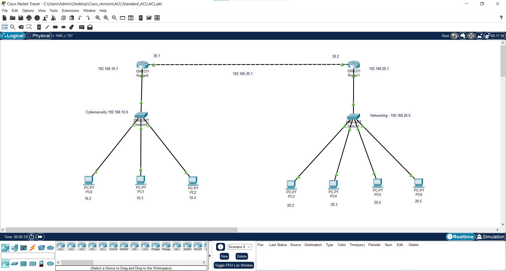 | 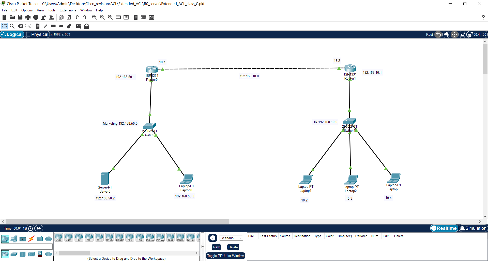 |

---

### 2. Border Gateway Protocol (BGP)
Directory: [`./BGP`](./BGP)

Border Gateway Protocol is the foundational exterior gateway routing protocol (EGP) powering the global Internet.

- **3-Router eBGP Multi-AS Architecture (`BGP/BGP_3_Router`):**
  - Simulates three autonomous systems: **AS 1** (Router 0 - `192.168.10.0/24`), **AS 2** (Router 1 - `192.168.20.0/24`, serving as a transit provider), and **AS 3** (Router 2 - `192.168.30.0/24`).
  - Implements eBGP neighbor peering over `/24` interconnect WAN subnets (`192.168.1.0/24` and `192.168.2.0/24`).
  - Utilizes `neighbor <IP> next-hop-self` on Router 1 to preserve path attributes and ensure reachability across non-directly connected autonomous systems.
- **BGP Class C Network (`BGP/BGP_Class_C`):**
  - Point-to-point eBGP session between two border routers connecting separate enterprise domains.

| BGP 3-Router Multi-AS Topology | BGP Class C Topology |
|:---:|:---:|
| 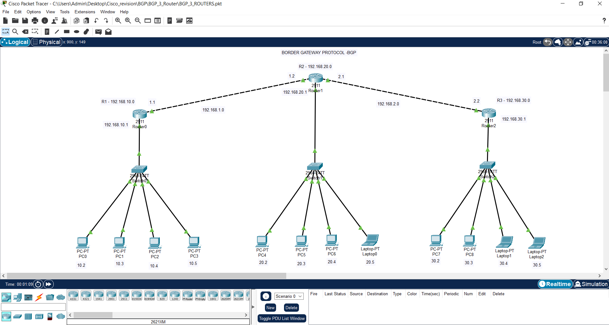 | 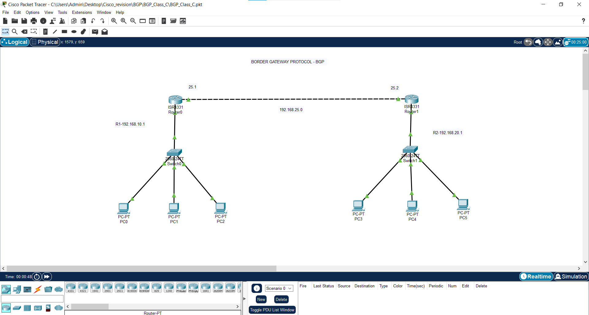 |

---

### 3. Dynamic Host Configuration Protocol (DHCP)
Directory: [`./DHCP`](./DHCP)

Automates client IP address leasing, default gateway configuration, and DNS server assignment.

- **DHCP Server with Cisco Router (`DHCP/DHCP_Server_router`):**
  - Employs Cisco IOS `ip dhcp pool` configuration with network scoping, lease options, and address exclusion (`ip dhcp excluded-address`) to safeguard infrastructure interfaces.
- **Class B Wireless DHCP Infrastructure (`DHCP/Wireless`):**
  - Incorporates Class B address ranges (`172.16.0.0/16`) serving both wired desktop environments and wireless end devices (smartphones, tablets, and wireless laptops) bridged through Wireless Access Points.

| Router DHCP Topology | Wireless Class B DHCP Topology |
|:---:|:---:|
| 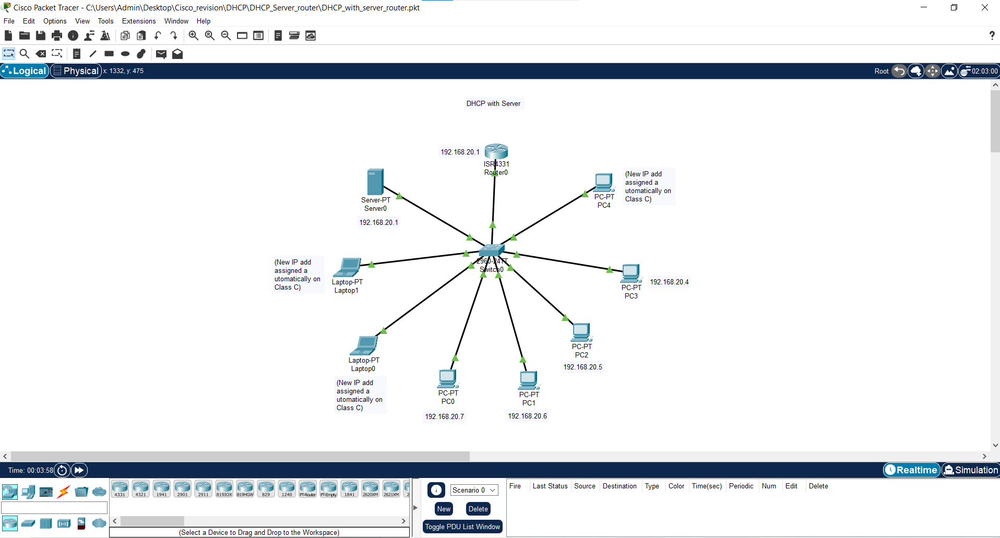 | 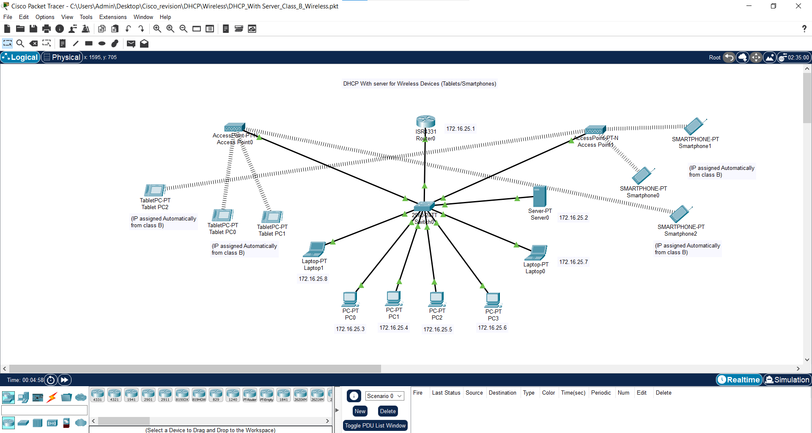 |

---

### 4. HTTP Web Server & Cross-Media Access
Directory: [`./HTTP_Server`](./HTTP_Server)

Demonstrates the deployment and accessibility of internal web server infrastructure across heterogeneous network media:

- Configured a dedicated HTTP/HTTPS application server on network segment `192.168.170.0/24`.
- Integrated multiple Wireless Access Points (AP0, AP1, AP2) with custom SSIDs and authentication.
- Validated HTTP web page rendering and ICMP reachability across desktops, laptops, tablets, and smartphones via simulated client web browsers.

| HTTP Web Browser Client Verification |
|:---:|
| 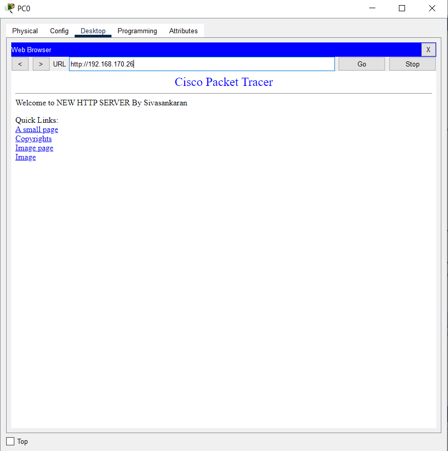 |

---

### 5. Local Area Network (LAN) Topologies
Directory: [`./LAN`](./LAN)

Foundational topologies highlighting the difference between Layer 2 intra-subnet switching and Layer 3 inter-subnet routing:

- **Single LAN:** Star topology connecting multiple workstations to a single Cisco Catalyst switch within the same broadcast domain and IP subnet.
- **Dual LAN with Router:** Connects two isolated subnets through a dual-interface Cisco router (`Gig 0/0` and `Gig 0/1`), demonstrating default gateway forwarding and routing table lookups.

| Single & Dual LAN Topologies |
|:---:|
| 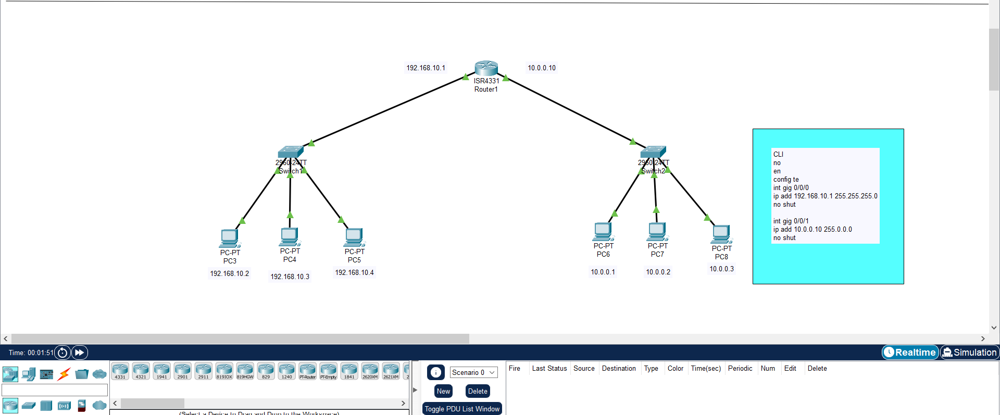 |

---

### 6. Open Shortest Path First (OSPF)
Directory: [`./OSPF`](./OSPF)

Implements high-performance, link-state interior gateway routing (IGP) using Dijkstra's Shortest Path First (SPF) algorithm.

- **Single-Area OSPF (`OSPF/Single_Area`):**
  - Configures all router interfaces within backbone **Area 0**.
  - Interconnects departmental subnets: Human Resources (HR), Marketing (Mktg), and Customer Support with zero convergence delays.
- **Hierarchical Multi-Area OSPF (`OSPF/Multi_area`):**
  - Scalable enterprise campus design segmented into:
    - **Backbone Area 0** (Core interconnect)
    - **Area 1** (Branch / Departmental network 1)
    - **Area 2** (Branch / Departmental network 2)
  - Configures Area Border Routers (ABRs) to restrict Link-State Advertisement (LSA) flooding within individual area boundaries.

| Single-Area OSPF Topology | Multi-Area OSPF Topology |
|:---:|:---:|
| 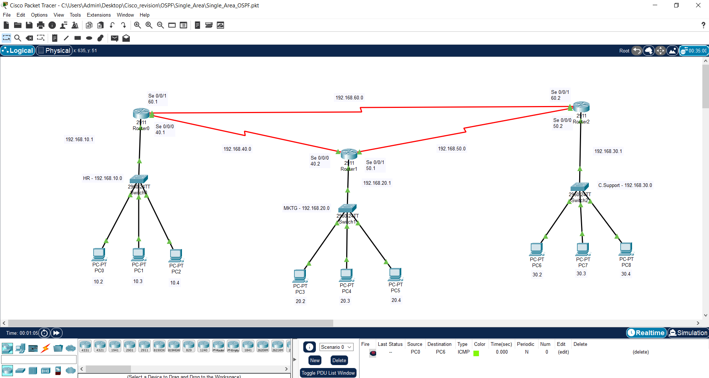 | 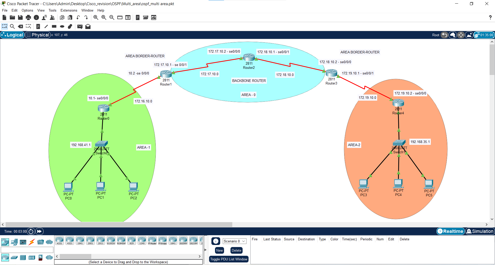 |

---

### 7. Routing Information Protocol (RIP)
Directory: [`./RIP`](./RIP)

Explores distance-vector routing fundamentals utilizing the Routing Information Protocol (RIP):

- Configured dynamic routing across diverse Class A (`10.0.0.0/8`) and Class C (`192.168.x.x/24`) networks.
- Analyzed hop-count metric evaluation (maximum 15 hops), split-horizon loop prevention, and periodic 30-second routing table updates.

| RIP Dynamic Routing Topology |
|:---:|
| 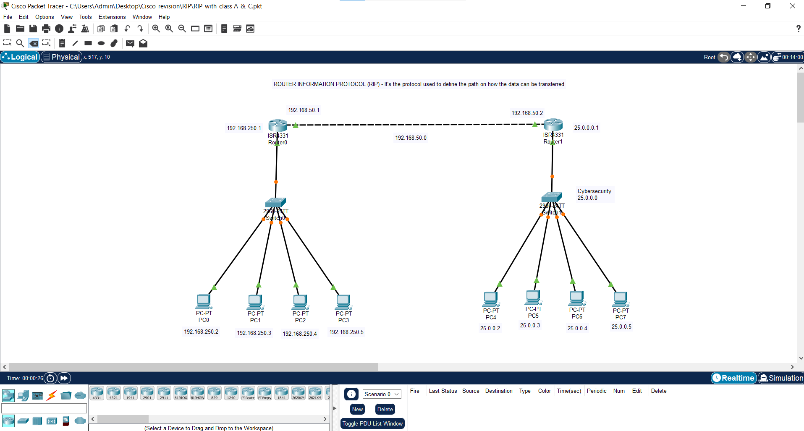 |

---

### 8. Secure Shell (SSH) Remote Management
Directory: [`./SSH`](./SSH)

Eliminates plain-text Telnet vulnerabilities by configuring cryptographic SSH v2 remote administration across network infrastructure:

- **Catalyst Switch SSH Hardening (`SSH/switch`):**
  - Configured management Switch Virtual Interface (SVI) `interface vlan 1`.
  - Defined IP domain-name, generated 1024-bit RSA keypairs (`crypto key generate rsa`), and restricted VTY lines (`transport input ssh`).
- **Router SSH with Integrated DHCP (`SSH/Router`):**
  - Configured local authentication accounts, secret passwords, enabled `service password-encryption`, and confirmed SSH login from client PCs.
- **Unified DHCP & SSH (`SSH/DHCP_SSH`):**
  - Combined automatic client provisioning with secure network infrastructure administration.

| Switch SSH Topology | Router SSH Topology |
|:---:|:---:|
| 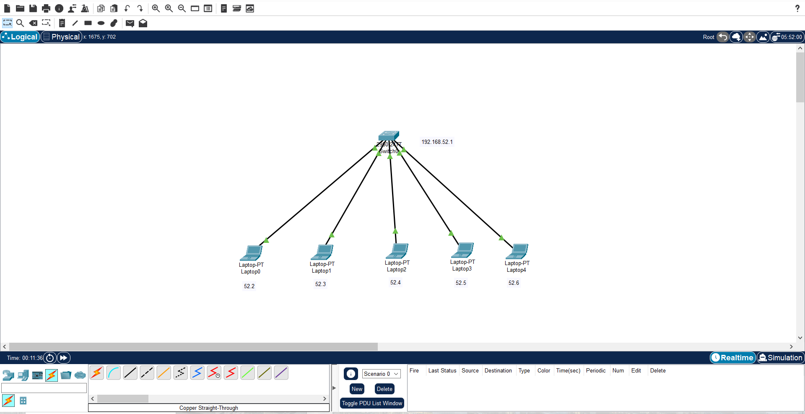 | 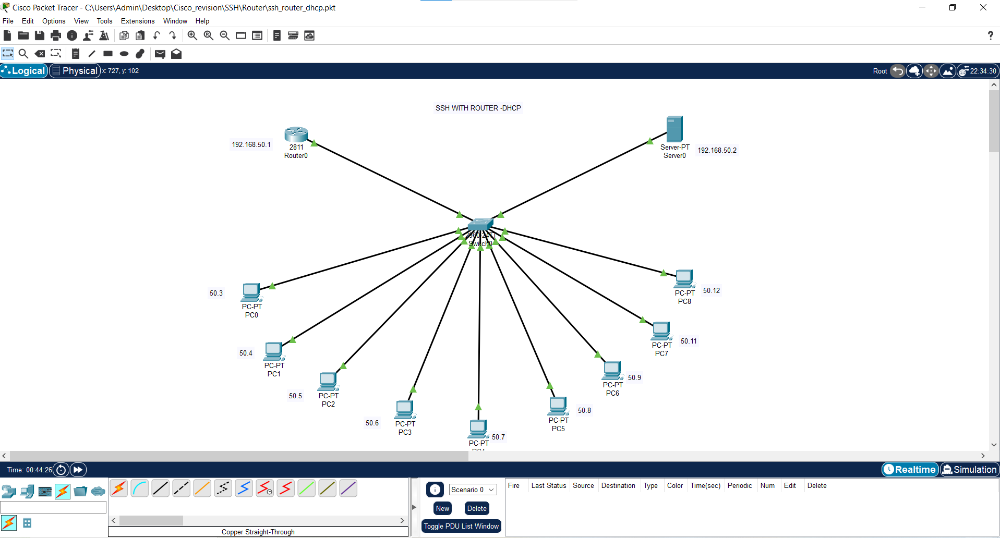 |

---

### 9. Static IP Addressing & Subnet Routing
Directory: [`./Static_IP`](./Static_IP)

Focuses on manual IPv4 address planning and deterministic routing:

- Implemented a Class B enterprise scheme (`172.16.0.0/16`) partitioned across Cybersecurity and Networking divisions.
- Manually populated static route tables (`ip route <dest-network> <subnet-mask> <next-hop>`) to achieve deterministic end-to-end communication without routing protocol overhead.

| Static IP Addressing Topology |
|:---:|
|  |

---

### 10. Virtual Local Area Networks (VLAN) & Trunking
Directory: [`./VLAN`](./VLAN)

Implements Layer 2 network segmentation to contain broadcast domains and enforce departmental privacy:

- **Single Switch VLAN Segmentation:**
  - Configured VLANs (VLAN 2, VLAN 3, VLAN 4) on an individual switch to isolate traffic between workgroups on the same physical hardware.
- **Dual Switch 802.1Q VLAN Trunking:**
  - Configured multiple switches interconnected via IEEE 802.1Q trunk links (`switchport mode trunk`).
  - Spanned **HR Department**, **Marketing Department**, and **Sales Department** VLANs across switches, verifying that traffic remains confined to its respective VLAN across the trunk.

| Single Switch VLAN Segmentation | Multi-Switch 802.1Q VLAN Trunking |
|:---:|:---:|
| 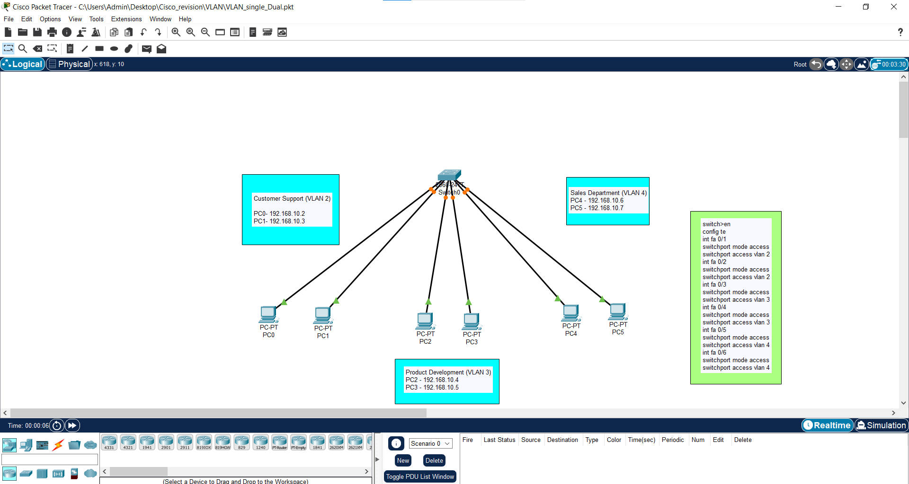 | 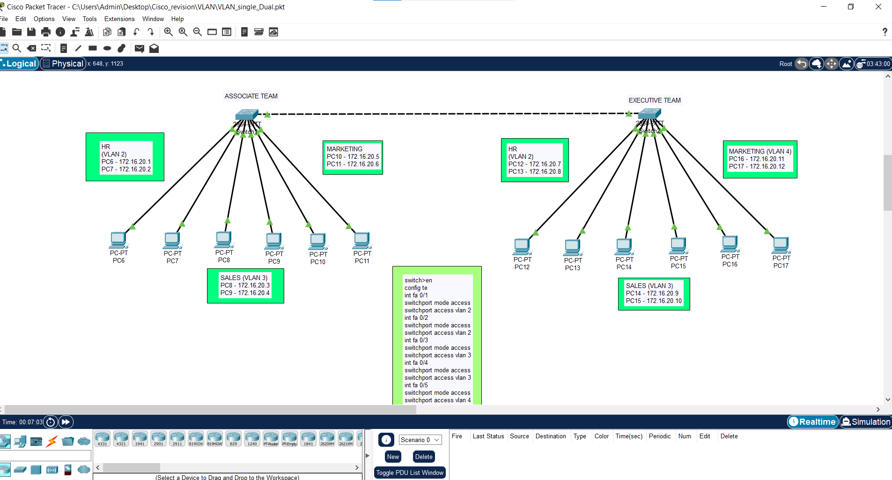 |

---

### 11. Voice over IP (VoIP) & IP Telephony
Directory: [`./VoIP`](./VoIP)

Enterprise IP telephony deployment leveraging Cisco CallManager Express (CME) on integrated services routers:

- **Telephony Services Setup (`VoIP/Telephony`):**
  - Configured Cisco router CME engine: `telephony-service`, defining `max-ephones 6` and `max-dn 6`.
  - Bound the SCCP socket using `ip source-address <Router-IP> port 2000`.
  - Configured DHCP pool with **Option 150** (`option 150 ip <TFTP-Server-IP>`) to allow Cisco 7960 IP Phones to download configuration firmware.
  - Created directory numbers (`ephone-dn 1` to `5`) with custom extensions (e.g., `2614128`, `6504965`, `2614131`) and verified active phone-to-phone voice calling.
- **VoIP with PC Port Convergence (`VoIP/VoIP_with_PC`):**
  - Simulated real-world office cubicle wiring by connecting desktop PCs directly into the auxiliary 10/100 PC port of Cisco IP Phones.
  - Configured switch access ports with dual VLAN tagging: an access VLAN for untagged PC data and `switchport voice vlan` for 802.1p CoS voice traffic.

| Cisco CME Telephony Topology | Converged Voice + PC Topology |
|:---:|:---:|
| 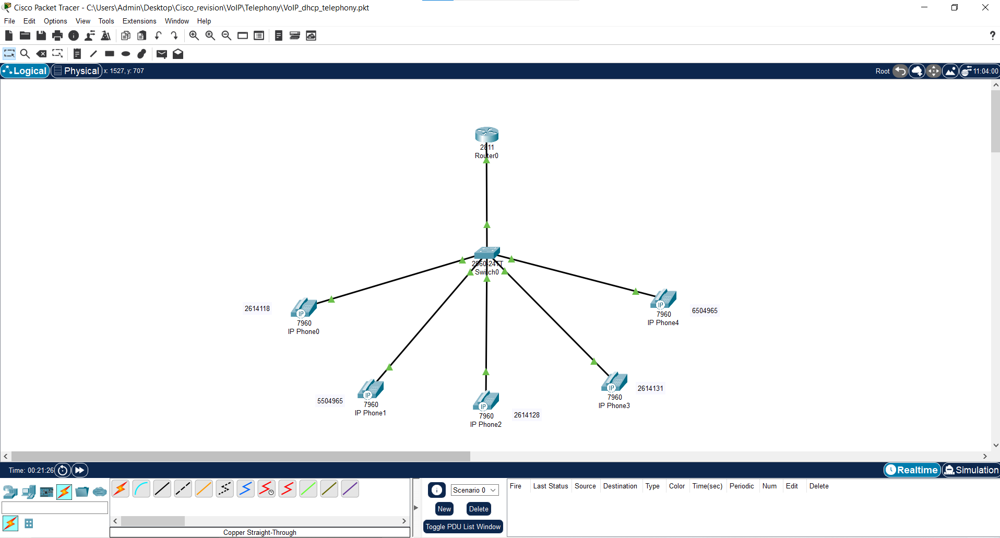 | 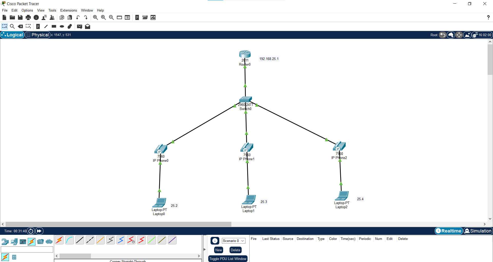 |

---

## 💻 Cisco IOS CLI Command Cheat Sheet

A quick reference guide of key Cisco IOS commands configured across the projects in this repository:

### 1. VLAN & 802.1Q Trunking
```cisco
Switch(config)# vlan 10
Switch(config-vlan)# name HR_Dept
Switch(config-vlan)# exit
Switch(config)# interface FastEthernet 0/1
Switch(config-if)# switchport mode access
Switch(config-if)# switchport access vlan 10
Switch(config)# interface GigabitEthernet 0/1
Switch(config-if)# switchport mode trunk
```

### 2. OSPF Dynamic Routing
```cisco
Router(config)# router ospf 1
Router(config-router)# router-id 1.1.1.1
Router(config-router)# network 192.168.10.0 0.0.0.255 area 0
Router(config-router)# network 10.1.1.0 0.0.0.3 area 1
```

### 3. BGP Multi-AS Peering
```cisco
Router(config)# router bgp 2
Router(config-router)# neighbor 192.168.1.1 remote-as 1
Router(config-router)# neighbor 192.168.2.2 remote-as 3
Router(config-router)# neighbor 192.168.2.2 next-hop-self
Router(config-router)# network 192.168.20.0 mask 255.255.255.0
```

### 4. Standard & Extended Access Control Lists (ACL)
```cisco
! Standard ACL (Filter by source host)
Router(config)# ip access-list standard 10
Router(config-std-nacl)# permit host 192.168.10.2
Router(config-std-nacl)# deny any
Router(config)# interface GigabitEthernet 0/0/0
Router(config-if)# ip access-group 10 out

! Extended ACL (Permit HTTP, Deny ICMP Ping)
Router(config)# access-list 100 permit tcp 192.168.10.0 0.0.0.255 host 192.168.30.10 eq 80
Router(config)# access-list 100 deny icmp 192.168.10.0 0.0.0.255 host 192.168.30.10
Router(config)# access-list 100 permit ip any any
Router(config)# interface GigabitEthernet 0/0/1
Router(config-if)# ip access-group 100 in
```

### 5. SSH v2 Hardening
```cisco
Device(config)# hostname Core-R1
Core-R1(config)# ip domain-name cisco.lab
Core-R1(config)# crypto key generate rsa general-keys modulus 1024
Core-R1(config)# ip ssh version 2
Core-R1(config)# username admin privilege 15 secret AdminPass123
Core-R1(config)# service password-encryption
Core-R1(config)# line vty 0 4
Core-R1(config-line)# login local
Core-R1(config-line)# transport input ssh
```

### 6. Cisco CallManager Express (VoIP Telephony)
```cisco
Router(config)# ip dhcp pool VOICE_POOL
Router(dhcp-config)# network 192.168.20.0 255.255.255.0
Router(dhcp-config)# default-router 192.168.20.1
Router(dhcp-config)# option 150 ip 192.168.20.1

Router(config)# telephony-service
Router(config-telephony)# max-ephones 6
Router(config-telephony)# max-dn 6
Router(config-telephony)# ip source-address 192.168.20.1 port 2000
Router(config-telephony)# auto assign 1 to 6

Router(config)# ephone-dn 1
Router(config-ephone-dn)# number 2614128
```

---

## 🛠 Hardware & Software Specifications

- **Simulation Platform:** Cisco Packet Tracer (Versions 7.3, 8.0, 8.2, 8.2.1+)
- **Cisco Routers:** 
  - Cisco 2911 Integrated Services Router (ISR)
  - Cisco 2811 Integrated Services Router (Telephony CME capable)
  - Cisco 1941 / 1841 Modular Routers
- **Cisco Switches:** 
  - Cisco Catalyst 2960-24TT Layer 2 Switches
  - Cisco 3560-24PS Layer 3 Multi-layer Switches
- **VoIP Endpoints:** Cisco IP Phone 7960 Series
- **Wireless Infrastructure:** Access Point-PT, Home Gateways
- **Computing Endpoints:** Desktop PCs, Laptops, Mobile Tablets, Smartphones, Dedicated Servers (HTTP / TFTP / DHCP)

---

## 🔍 Verification & Testing Methodology

Each lab within this portfolio has been thoroughly verified using standard Cisco troubleshooting diagnostics:

1. **ICMP Connectivity Tests:** CLI `ping` execution across identical subnets, cross-department links, and WAN interfaces.
2. **Path & Trace Route Analysis:** `traceroute` execution to verify multi-hop forwarding paths and next-hop selections.
3. **Routing Table Inspections:** 
   - `show ip route` – Validates route codes (`C` Connected, `S` Static, `R` RIP, `O` OSPF, `B` BGP).
   - `show ip ospf neighbor` – Validates OSPF neighbor adjacency states (`FULL/BDR`, `FULL/DR`).
   - `show ip bgp summary` – Confirms eBGP state establishment.
4. **Security & Access Audits:** 
   - `show access-lists` – Verifies permit/deny packet match counters.
   - `show ip ssh` & `show crypto key mypubkey rsa` – Confirms SSH version 2 operation and key integrity.
5. **Telephony Status:**
   - `show ephone summary` – Checks registered IP phones and assigned MAC addresses.
   - Active simulated calls testing audio stream connection between directory numbers.

---

## 🚀 Getting Started & How to Run

### Prerequisites
- Install **Cisco Packet Tracer** (v8.0 or newer recommended): [Download from Cisco Networking Academy](https://www.netacad.com/courses/packet-tracer)
- Git installed on your local workstation.

### Step 1: Clone the Repository
```bash
git clone https://github.com/dhanush342/My-Cisco-Projects.git
cd My-Cisco-Projects
```

### Step 2: Open a Lab Topology
1. Launch **Cisco Packet Tracer**.
2. Go to **File -> Open** (or press `Ctrl + O`).
3. Browse into any module directory (e.g., `VoIP/Telephony/` or `OSPF/Multi_area/`).
4. Select the `.pkt` file (e.g., `VoIP_dhcp_telephony.pkt`).

### Step 3: Inspect Configurations & Simulate
- Click on any router or switch to open the **CLI tab**.
- Cross-reference with the corresponding `.txt` configuration file provided in that directory.
- Use the **Simulation Mode** (Shift + S) to inspect packet headers (PDU inspection) as frames traverse switches and routers.
- Review the included `.png` screenshots to verify expected terminal outputs and topology states.

---

## 👨‍💻 Author & Acknowledgments

**Nagineni Dhanush**  
- **GitHub:** [@dhanush342](https://github.com/dhanush342)  
- **Repository:** [https://github.com/dhanush342/My-Cisco-Projects](https://github.com/dhanush342/My-Cisco-Projects)  

*Special thanks to my college networking professors and lab instructors for their guidance, mentorship, and foundational teachings in computer network architecture.*

---

## 📄 License

This repository is distributed under the [MIT License](LICENSE). Feel free to use these lab designs and configuration templates for learning, academic study, and CCNA preparation.