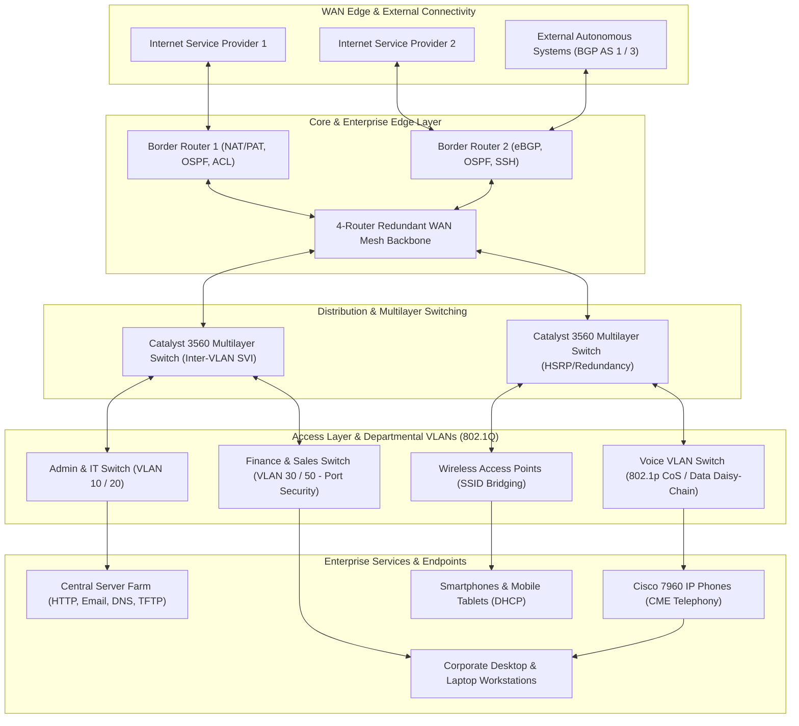

# 🌐 Cisco Packet Tracer Networking Labs & Enterprise Architectures Portfolio

[](https://www.netacad.com/courses/packet-tracer)
[](https://github.com/dhanush342/My-Cisco-Projects)
[](https://github.com/dhanush342/My-Cisco-Projects)
[](https://github.com/dhanush342/My-Cisco-Projects)
[](LICENSE)

A comprehensive, production-grade engineering portfolio containing **17 computer networking architectures, protocol implementations, security controls, and converged telephony solutions** simulated in **Cisco Packet Tracer**.

This repository encompasses foundational Layer 2/Layer 3 protocols, advanced multi-area dynamic routing, cryptographic device hardening, enterprise team capstones, and five full-scale industry network deployments (commercial banking, financial trading floor, multi-campus enterprise, hospitality systems, and branch offices).

---

## 📑 Table of Contents

- [Executive Overview & Key Competencies](#-executive-overview--key-competencies)
- [Enterprise Network Architecture Model](#-enterprise-network-architecture-model)
- [Master Repository Index & Architecture Matrix](#-master-repository-index--architecture-matrix)
- [🏢 Enterprise Industry Projects Suite (`PKT-Projects`)](#-enterprise-industry-projects-suite-pkt-projects)
  - [Project #1: Small Office Branch Network Design](#project-1-small-office-branch-network-design)
  - [Project #2: Multi-Area Enterprise Campus Network Design](#project-2-multi-area-enterprise-campus-network-design)
  - [Project #3: 4-Story Commercial Banking & Insurance System](#project-3-4-story-commercial-banking--insurance-system)
  - [Project #4: High-Availability Trading Floor Support Centre](#project-4-high-availability-trading-floor-support-centre)
  - [Project #5: Vic Modern Hotel 3-Tier Hospitality Network](#project-5-vic-modern-hotel-3-tier-hospitality-network)
- [🌟 Featured University Capstone: Small-Scale Enterprise Office Network](#-featured-university-capstone-small-scale-enterprise-office-network)
- [🔬 Core Technology & Protocol Mastery Labs](#-core-technology--protocol-mastery-labs)
  - [1. Access Control Lists (ACL)](#1-access-control-lists-acl)
  - [2. Border Gateway Protocol (BGP)](#2-border-gateway-protocol-bgp)
  - [3. Dynamic Host Configuration Protocol (DHCP)](#3-dynamic-host-configuration-protocol-dhcp)
  - [4. HTTP Application Server & Cross-Media Access](#4-http-application-server--cross-media-access)
  - [5. Local Area Network (LAN) Topologies](#5-local-area-network-lan-topologies)
  - [6. Open Shortest Path First (OSPF)](#6-open-shortest-path-first-ospf)
  - [7. Routing Information Protocol (RIP)](#7-routing-information-protocol-rip)
  - [8. Secure Shell (SSH) Remote Management](#8-secure-shell-ssh-remote-management)
  - [9. Static IP Addressing & Subnet Routing](#9-static-ip-addressing--subnet-routing)
  - [10. Virtual Local Area Networks (VLAN) & Trunking](#10-virtual-local-area-networks-vlan--trunking)
  - [11. Voice over IP (VoIP) & IP Telephony](#11-voice-over-ip-voip--ip-telephony)
- [💻 Cisco IOS CLI Command Cheat Sheet](#-cisco-ios-cli-command-cheat-sheet)
- [🛠 Hardware & Simulation Platform Specifications](#-hardware--simulation-platform-specifications)
- [🔍 Verification & Diagnostic Testing Methodology](#-verification--diagnostic-testing-methodology)
- [🚀 Quick Start & How to Simulate](#-quick-start--how-to-simulate)
- [👨‍💻 Author & Acknowledgments](#-author--acknowledgments)
- [📄 License](#-license)

---

## 🎯 Executive Overview & Key Competencies

The network architectures in this portfolio model real-world enterprise infrastructure aligned with Cisco CCNA and CCNP certification standards:

- **Layer 2 Switching & Campus Segmentation:** Broadcast domain isolation via IEEE 802.1Q trunking, multi-switch access layers, Voice VLAN tagging with CoS prioritization, and switchport port-security (sticky MAC learning with err-disable/shutdown violations).
- **Layer 3 Dynamic & Static Routing:** Subnet planning (VLSM/CIDR), Router-on-a-Stick (ROAS), Multilayer switch SVI routing, static route failover, distance-vector (RIP v1/v2), link-state (OSPF single-area & hierarchical multi-area with ABRs), and path-vector inter-domain routing (eBGP multi-AS peering with `next-hop-self`).
- **High-Availability & Redundant WAN:** Dual-ISP multihoming, redundant meshed core backbones, and alternate route convergence preventing single points of failure (SPOF).
- **Network Security & Infrastructure Hardening:** Standard source-based ACLs, Extended Layer 4 protocol filtering (TCP/HTTP/ICMP controls), Port Address Translation (NAT/PAT overload), cryptographic SSH v2 management with 1024-bit RSA keypairs, privilege level delegation, and encrypted password vaults (`service password-encryption`).
- **Dynamic Infrastructure Services:** Cisco IOS DHCP server pools with network scoping, excluded addresses, Option 150 TFTP server assignment for VoIP endpoints, wireless Access Point bridging, and intranet HTTP/Email hosting.
- **Converged Voice & Data Networks (VoIP):** Cisco Unified CallManager Express (CME) IP telephony, Skinny Client Control Protocol (SCCP), ephone-dn automated directory number assignment, and PC-to-IP-Phone daisy-chaining with dual VLAN tagging.

---

## 🏗 Enterprise Network Architecture Model

The following diagram illustrates how the architectural tiers and technologies implemented across this portfolio interconnect in a production enterprise environment:



---

## 🗂 Master Repository Index & Architecture Matrix

This portfolio is systematically organized into three distinct tiers:

### A. Full-Scale Enterprise Industry Projects (`PKT-Projects`)
| Project | Industry Scenario | Key Technologies | Devices Used | Packet Tracer Simulation | Documentation |
|---|---|---|---|---|:---:|
| **Project #1** | Food Supply Branch (Ridoine Co.) | Router-on-a-Stick, VLANs, DHCP, Wi-Fi APs | 1 Router, 1 Switch, 3 APs, PCs | [`Project #1.pkt`](PKT-Projects/Project%20%231/Project%20%231.pkt) | [README.txt](PKT-Projects/Project%20%231/README.txt) |
| **Project #2** | Multi-Campus Enterprise (4 Zones) | 4-Router Mesh WAN Backbone, Local DHCP Servers | 4 Routers, 4 Switches, 4 Servers, 12 Laptops | [`Project #2.pkt`](PKT-Projects/Project%20%232/Project%20%232.pkt) | [README.txt](PKT-Projects/Project%20%232/README.txt) |
| **Project #3** | 4-Story Commercial Bank (Radeon Bank) | OSPF, Sticky Port Security, SSH, HTTP & Email | Cisco Routers, Switches, Servers, APs | [`Project #3.pkt`](PKT-Projects/Project%20%233/Project%20%233.pkt) | [README.txt](PKT-Projects/Project%20%233/README.txt) |
| **Project #4** | Trading Floor Support Centre (600 Staff) | Dual ISP WAN Redundancy, MLS, OSPF, NAT/PAT, ACL | 2 ISP Routers, 2 Routers, 2 MLS, Servers | [`Project #4.pkt`](PKT-Projects/Project%20%234/Project%20%234.pkt) | [README.txt](PKT-Projects/Project%20%234/README.txt) |
| **Project #5** | 3-Floor Modern Hotel (Vic Hotel) | 8 VLANs, Router-on-a-Stick, OSPF, Wi-Fi, DHCP | 3 Routers, 3 Switches, 3 APs, Printers | [`Project #5.pkt`](PKT-Projects/Project%20%235/Project%20%235.pkt) | [README.txt](PKT-Projects/Project%20%235/README.txt) |

### B. University Capstone Project (`final work`)
| Project | Description | Key Technologies | Devices Used | Packet Tracer Simulation | Documentation |
|---|---|---|---|---|:---:|
| **Enterprise Office** | 4 Departments + Server Room WAN | Dual-Router Serial WAN (10.0.0.0/8), Static Routing | 2 Routers, 4 Switches, 1 Server, Printers, PCs | [`SmallOfficeNetwork.pkt`](final%20work/SmallOfficeNetwork.pkt) | [README.md](final%20work/README.md) |

### C. Core Technology & Protocol Mastery Labs
| # | Module | Category | Primary Protocols & Concepts | Simulation File (`.pkt`) | CLI Configurations | Key Verification Artifacts |
|---|---|---|---|---|---|---|
| **01** | [ACL](./ACL) | Network Security | Standard ACL, Extended ACL, TCP/HTTP, ICMP Drop | `ACL.pkt`, `Extended_ACL_class_C.pkt` | `Standard ACL.txt`, `Extended ACL.txt` | Ping denial tests, web browsing checks |
| **02** | [BGP](./BGP) | Dynamic Routing | eBGP, Multi-AS Peering (AS 1, 2, 3), `next-hop-self` | `BGP_3_ROUTERS.pkt`, `BGP_Class_C.pkt` | `BGP_3_ROUTERS.txt`, `BGP_Class_C.txt` | Full mesh inter-AS ping matrices |
| **03** | [DHCP](./DHCP) | Network Services | IOS DHCP Server, Exclusions, Wireless AP, Class B | `DHCP_with_server_router.pkt`, `DHCP_With Server...` | `Dynamic Host Configuration... - CLI.txt` | IP lease acquisition, wireless pings |
| **04** | [HTTP_Server](./HTTP_Server) | Application Services | HTTP/HTTPS hosting, AP configuration, client access | `HTTP_wired_wireless.pkt` | `CLI_command.txt` | Browser HTTP render, tablet/smartphone pings |
| **05** | [LAN](./LAN) | Network Foundations | Layer 2 Switching, Layer 3 Dual-LAN Interconnection | `LAN_single_Dual.pkt` | `Single_LAN.txt`, `Dual LAN.txt` | Intra-LAN & Inter-LAN ping tests |
| **06** | [OSPF](./OSPF) | Dynamic Routing | Link-State, Single-Area (Area 0), Multi-Area (0, 1, 2) | `Single_Area_OSPF.pkt`, `ospf_multi area.pkt` | `Single_area_ospf.txt`, `CLI_commands.txt` | Department reachability, inter-area convergence |
| **07** | [RIP](./RIP) | Dynamic Routing | Distance Vector, Hop-count metric, Class A & C subnets | `RIP_with_class A_&_C.pkt` | `Router Information Protocol (RIP)-CLI.txt` | Routing convergence, cross-subnet ping |
| **08** | [SSH](./SSH) | Device Security | SSH v2, RSA 1024-bit crypto keys, SVI, Password vaults | `SSH_switch.pkt`, `ssh_router_dhcp.pkt`, `DHCP_SSH.pkt` | `CLI Command.txt`, `CLI_command.txt` | Remote terminal sessions, encrypted passwords |
| **09** | [Static_IP](./Static_IP) | Network Foundations | Class B Static Addressing (172.16.x.x), Gateway Routing | `Static_IP_class_B.pkt` | `Static - Information Protocol.txt` | Departmental ping verification |
| **10** | [VLAN](./VLAN) | Layer 2 Segmentation | 802.1Q Trunking, Access Ports, Inter-Switch VLANs | `VLAN_single_Dual.pkt` | `Single_VLAN.txt`, `Double VLAN.txt` | Departmental broadcast isolation & trunk tests |
| **11** | [VoIP](./VoIP) | Converged Telephony | Cisco CME, Ephone-DN, DHCP Option 150, Voice VLAN | `VoIP_dhcp_telephony.pkt`, `VoIP_with_pc.pkt` | `Router_CLI.txt`, `switch_CLI_config .txt` | Active phone calls, dial tone, phone displays |

---

## 🏢 Enterprise Industry Projects Suite (`PKT-Projects`)
*Parent Directory: [`./PKT-Projects`](./PKT-Projects)*

This suite contains five large-scale enterprise network simulation architectures designed to fulfill rigorous industrial specifications:

### Project #1: Small Office Branch Network Design
*Directory: [`./PKT-Projects/Project #1`](./PKT-Projects/Project%20%231)*
- **Scenario:** Ridoine Company, an Australian food trading enterprise (2M+ customers), required a brand-new independent branch network near Bonalbo.
- **Implementation:**
  - Segmented the campus into three discrete departments: **Admin/IT**, **Finance/HR**, and **Customer Service/Reception**.
  - Configured 802.1Q Router-on-a-Stick (ROAS) sub-interfaces on a central Cisco router.
  - Implemented dynamic IPv4 addressing via an IOS DHCP server configured on the router.
  - Deployed Cisco Access Points per department for high-density wireless connectivity.
  - Subnetted the parent ISP address block `192.168.1.0/24`.

| Project #1: Small Office Branch Network Topology |
|:---:|
|  |

---

### Project #2: Multi-Area Enterprise Campus Network Design
*Directory: [`./PKT-Projects/Project #2`](./PKT-Projects/Project%20%232)*
- **Scenario:** A multi-site enterprise infrastructure spanning four operational geographical zones (Area 1, Area 2, Area 3, Area 4) requiring core fault tolerance and localized services.
- **Implementation:**
  - **4-Router Meshed Core:** 4x Cisco 2911 ISR routers interconnected via 5 redundant point-to-point WAN links (`192.168.4.0/30`, `192.168.5.0/30`, `192.168.6.0/30`, `192.168.7.0/30`, and diagonal cross-link `192.168.8.0/30`).
  - **Regional Campus Areas:** Area 1 (`192.168.0.0/24`), Area 2 (`192.169.1.0/24`), Area 3 (`192.168.2.0/24`), Area 4 (`192.168.3.0/24`).
  - **Localized DHCP Infrastructure:** Dedicated DHCP server per campus zone providing rapid lease assignment independent of WAN state.
  - **Fault-Tolerant Convergence:** Alternate routing paths maintain continuous packet flow during simulated link failures.

| Project #2: Multi-Area Enterprise Campus Network Topology |
|:---:|
|  |

---

### Project #3: 4-Story Commercial Banking & Insurance System
*Directory: [`./PKT-Projects/Project #3`](./PKT-Projects/Project%20%233)*
- **Scenario:** Radeon Company Ltd., a US-owned banking and insurance institution, expanded into Africa with a 4-story commercial building in Nairobi, Kenya.
- **Implementation:**
  - **Dynamic Routing:** Single-Area OSPF deployed across routers for dynamic routing convergence and optimal path selection.
  - **Switchport Security:** Strict Layer 2 port-security using sticky MAC address learning (`switchport port-security mac-address sticky`) and violation shutdown mode to prevent rogue hardware connection.
  - **Remote Administration:** Cryptographic SSH v2 configured across all routing devices with RSA key generation, custom console banners, and encrypted credentials.
  - **Centralized Application Services:** Dedicated corporate HTTP intranet and E-mail application servers.
  - **Departmental Wi-Fi:** Scaled wireless coverage accommodating ~60 wired/wireless users per department under base subnet `192.168.10.0`.

| Project #3: Commercial Banking & Insurance Network Topology |
|:---:|
|  |

---

### Project #4: High-Availability Trading Floor Support Centre
*Directory: [`./PKT-Projects/Project #4`](./PKT-Projects/Project%20%234)*
- **Scenario:** A high-throughput financial trading support centre housing 600 operators requiring 100% uptime, multihomed ISP uplinks, multilayer switching, and security controls.
- **Implementation:**
  - **Dual ISP Redundancy:** Two edge routers connected to two separate Internet Service Providers via public subnets (`195.136.17.0/30`, `195.136.17.4/30`).
  - **Multilayer Core Switching:** Dual Cisco Catalyst Layer 3 multilayer switches handling wire-speed inter-VLAN routing, SVIs, and hardware packet switching.
  - **Departmental Floor Distribution:**
    - Floor 1: Sales & Marketing (120 users), Human Resources & Logistics (120 users).
    - Floor 2: Finance & Accounts (120 users), Admin & Public Relations (120 users).
    - Floor 3: ICT Department (120 users) and Central Server Farm (12 mission-critical servers).
  - **Security, NAT & ACL:** Outbound Port Address Translation (PAT/NAT Overload) sharing ISP IP pools, Ingress/Egress ACL traffic policies, and sticky port-security on financial desks.

| Project #4: High-Availability Trading Floor Support Centre Topology |
|:---:|
|  |

---

### Project #5: Vic Modern Hotel 3-Tier Hospitality Network
*Directory: [`./PKT-Projects/Project #5`](./PKT-Projects/Project%20%235)*
- **Scenario:** A 3-floor luxury hospitality property requiring a unified network bridging guest reception, store, logistics, finance, HR, marketing, admin, and IT.
- **Implementation:**
  - **8 Departmental VLANs:**
    - Floor 1: Reception (`VLAN 80`, `192.168.8.0/24`), Store (`VLAN 70`, `192.168.7.0/24`), Logistics (`VLAN 60`, `192.168.6.0/24`).
    - Floor 2: Finance (`VLAN 50`, `192.168.5.0/24`), HR (`VLAN 40`, `192.168.4.0/24`), Sales/Marketing (`VLAN 30`, `192.168.3.0/24`).
    - Floor 3: Admin (`VLAN 20`, `192.168.2.0/24`), IT (`VLAN 10`, `192.168.1.0/24`).
  - **Dynamic Routing & Switching:** Multi-router OSPF configuration connecting floor switches via server room routers.
  - **Hospitality Services:** Dedicated departmental network printers, floor-wide guest/staff Wi-Fi access points, and router-managed DHCP pools.
  - **Port Security:** Dedicated technician port security on IT switch port `fa0/1`.

| Project #5: Vic Modern Hotel Hospitality Network Topology |
|:---:|
|  |

---

## 🌟 Featured University Capstone: Small-Scale Enterprise Office Network
*Directory: [`./final work`](./final%20work)*

Completed collaboratively with university colleagues, this project models an enterprise corporate branch interconnecting four distinct departmental subnets and a mission-critical server room over a point-to-point Serial WAN link:

- **Enterprise Subnet Plan & Device Inventory:**
  - **Computer Department (`192.168.3.0/24`)**: 3 Employee PCs, 1 Manager PC, Department Printer connected to `Router-PT Main` via `Fa1/0` (`192.168.3.1`).
  - **Server Room (`1.0.0.0/8`)**: Central Enterprise Server (`1.0.0.2`) & Admin Laptop (`1.0.0.3`) connected to `Router-PT Main` via `Fa0/0` (`1.0.0.1`).
  - **IT Department (`192.168.2.0/24`)**: 2 Employee PCs, 1 Manager PC, IT Network Printer connected to `Router-PT Router-1` via `Fa1/0` (`192.168.2.1`).
  - **Chairman Suite (`192.168.1.0/24`)**: Chairman PC (`192.168.1.2`) & Vice Chairman PC (`192.168.1.3`) connected to `Router-PT Router-1` via `Fa0/0` (`192.168.1.1`).
  - **WAN Serial Interconnect (`10.0.0.0/8`)**: High-speed point-to-point serial DCE/DTE connection between `Router-PT Main` (`10.0.0.1`) and `Router-PT Router-1` (`10.0.0.2`).
- **Deterministic Static Routing:** Complete bi-directional `ip route` configuration ensuring zero routing protocol overhead and secure, deterministic routing between executive, technical, and server subnets.

| Capstone Team Topology — Small-Scale Enterprise Office Network |
|:---:|
|  |

---

## 🔬 Core Technology & Protocol Mastery Labs

### 1. Access Control Lists (ACL)
*Directory: [`./ACL`](./ACL)*

Packet filtering mechanisms enforcing security policies at network boundaries:
- **Standard ACL (`ACL/Standard_ACL`):** Source IP packet filtering (`access-list 10 permit host 192.168.10.2`) enforcing network isolation between Cybersecurity and Networking subnets.
- **Extended ACL (`ACL/Extended_ACL`):** Layer 4 inspection evaluating source/destination IPs, TCP/UDP protocols, and application ports. Implemented in **R0 Server** and **R1 Server** environments to allow web browsing (HTTP port 80) while dropping ICMP echo requests to protect corporate servers.

| Standard ACL Topology | Extended ACL (R0 Server) Topology |
|:---:|:---:|
|  |  |

---

### 2. Border Gateway Protocol (BGP)
*Directory: [`./BGP`](./BGP)*

Simulates inter-domain exterior routing powering internet-scale peering:
- **3-Router eBGP Multi-AS Architecture (`BGP/BGP_3_Router`):** Three autonomous systems: **AS 1** (Router 0 - `192.168.10.0/24`), **AS 2** (Router 1 - `192.168.20.0/24`, transit AS), and **AS 3** (Router 2 - `192.168.30.0/24`). Configured `neighbor <IP> next-hop-self` to maintain BGP path attributes.
- **BGP Class C Network (`BGP/BGP_Class_C`):** Point-to-point eBGP session establishing inter-AS connectivity across enterprise border routers.

| BGP 3-Router Multi-AS Topology | BGP Class C Topology |
|:---:|:---:|
|  |  |

---

### 3. Dynamic Host Configuration Protocol (DHCP)
*Directory: [`./DHCP`](./DHCP)*

Automated network parameter provisioning (IP address, subnet mask, default gateway, and DNS):
- **Cisco IOS Router DHCP Server (`DHCP/DHCP_Server_router`):** Configured `ip dhcp pool` with IP exclusion safeguards (`ip dhcp excluded-address`).
- **Class B Wireless DHCP Infrastructure (`DHCP/Wireless`):** Class B addressing (`172.16.0.0/16`) serving both wired desktop workstations and wireless endpoints (smartphones, tablets) via Access Points.

| Router DHCP Topology | Wireless Class B DHCP Topology |
|:---:|:---:|
|  |  |

---

### 4. HTTP Application Server & Cross-Media Access
*Directory: [`./HTTP_Server`](./HTTP_Server)*

Enterprise application hosting and multi-media client access:
- Deployed internal web server on network segment `192.168.170.0/24`.
- Integrated three Wireless Access Points (AP0, AP1, AP2) with custom SSIDs and WPA2 security.
- Verified web page rendering and ICMP reachability across desktops, laptops, tablets, and smartphones.

| HTTP Web Browser Client Verification |
|:---:|
|  |

---

### 5. Local Area Network (LAN) Topologies
*Directory: [`./LAN`](./LAN)*

Foundational Layer 2 switching versus Layer 3 routing:
- **Single LAN:** Star topology connecting multiple workstations to a Cisco Catalyst switch within an unsegmented broadcast domain.
- **Dual LAN with Router:** Connects two isolated subnets via dual router interfaces (`Gig 0/0` and `Gig 0/1`), demonstrating default gateway forwarding.

| Single & Dual LAN Topologies |
|:---:|
|  |

---

### 6. Open Shortest Path First (OSPF)
*Directory: [`./OSPF`](./OSPF)*

High-performance link-state interior gateway routing (IGP) using Dijkstra's Shortest Path First (SPF) algorithm:
- **Single-Area OSPF (`OSPF/Single_Area`):** Configured backbone **Area 0** connecting Human Resources, Marketing, and Customer Support subnets.
- **Hierarchical Multi-Area OSPF (`OSPF/Multi_area`):** Segmented into **Backbone Area 0**, **Area 1**, and **Area 2**. Area Border Routers (ABRs) limit LSA flooding and optimize routing tables.

| Single-Area OSPF Topology | Multi-Area OSPF Topology |
|:---:|:---:|
|  |  |

---

### 7. Routing Information Protocol (RIP)
*Directory: [`./RIP`](./RIP)*

Distance-vector routing dynamics utilizing hop count as the primary metric:
- Configured dynamic routing across Class A (`10.0.0.0/8`) and Class C (`192.168.x.x/24`) subnets.
- Analyzed hop-count metrics (maximum 15 hops), split-horizon loop prevention, and 30-second periodic routing updates.

| RIP Dynamic Routing Topology |
|:---:|
|  |

---

### 8. Secure Shell (SSH) Remote Management
*Directory: [`./SSH`](./SSH)*

Cryptographic remote device administration replacing insecure Telnet:
- **Catalyst Switch SSH Hardening (`SSH/switch`):** SVI `interface vlan 1`, IP domain name, 1024-bit RSA key generation, and line vty restriction (`transport input ssh`).
- **Router SSH with Integrated DHCP (`SSH/Router`):** Local user privilege authentication, `service password-encryption`, and client-side terminal verification.
- **Unified DHCP & SSH (`SSH/DHCP_SSH`):** Combined dynamic client provisioning with secure network management.

| Switch SSH Topology | Router SSH Topology |
|:---:|:---:|
|  |  |

---

### 9. Static IP Addressing & Subnet Routing
*Directory: [`./Static_IP`](./Static_IP)*

Manual IPv4 addressing and deterministic route engineering:
- Class B enterprise scheme (`172.16.0.0/16`) divided between Cybersecurity and Networking departments.
- Manually populated routing tables (`ip route`) verifying reliable bidirectional communication without routing protocol overhead.

| Static IP Addressing Topology |
|:---:|
|  |

---

### 10. Virtual Local Area Networks (VLAN) & Trunking
*Directory: [`./VLAN`](./VLAN)*

Layer 2 network segmentation containing broadcast domains and enforcing departmental isolation:
- **Single Switch VLAN:** Isolated VLANs (VLAN 2, 3, 4) on a single physical switch.
- **Dual Switch 802.1Q Trunking:** Inter-switch trunk link (`switchport mode trunk`) spanning HR, Marketing, and Sales VLANs across multiple switches.

| Single Switch VLAN Segmentation | Multi-Switch 802.1Q VLAN Trunking |
|:---:|:---:|
|  |  |

---

### 11. Voice over IP (VoIP) & IP Telephony
*Directory: [`./VoIP`](./VoIP)*

Converged voice and data infrastructure leveraging Cisco Unified CallManager Express (CME):
- **Telephony Services Setup (`VoIP/Telephony`):** Configured Cisco router CME engine (`telephony-service`, `max-ephones 6`, `max-dn 6`), SCCP socket binding on port 2000, DHCP **Option 150** TFTP server assignment, and directory numbers (`ephone-dn 1` to `5`).
- **VoIP with PC Daisy-Chaining (`VoIP/VoIP_with_PC`):** Connected desktop PCs into the auxiliary 10/100 PC port of Cisco 7960 IP Phones. Configured switch ports with access VLANs for PC data and `switchport voice vlan` for 802.1p CoS voice prioritization.

| Cisco CME Telephony Topology | Converged Voice + PC Topology |
|:---:|:---:|
|  |  |

---

## 💻 Cisco IOS CLI Command Cheat Sheet

Production-ready Cisco IOS CLI templates used throughout these labs:

### 1. VLAN & 802.1Q Trunking
```cisco
Switch(config)# vlan 10
Switch(config-vlan)# name HR_Dept
Switch(config-vlan)# exit
Switch(config)# interface FastEthernet 0/1
Switch(config-if)# switchport mode access
Switch(config-if)# switchport access vlan 10
Switch(config)# interface GigabitEthernet 0/1
Switch(config-if)# switchport mode trunk
```

### 2. Router-on-a-Stick (ROAS) Inter-VLAN Routing
```cisco
Router(config)# interface GigabitEthernet 0/0.10
Router(config-subif)# encapsulation dot1Q 10
Router(config-subif)# ip address 192.168.10.1 255.255.255.0
Router(config)# interface GigabitEthernet 0/0.20
Router(config-subif)# encapsulation dot1Q 20
Router(config-subif)# ip address 192.168.20.1 255.255.255.0
```

### 3. OSPF Dynamic Routing (Single & Multi-Area)
```cisco
Router(config)# router ospf 1
Router(config-router)# router-id 1.1.1.1
Router(config-router)# network 192.168.10.0 0.0.0.255 area 0
Router(config-router)# network 10.1.1.0 0.0.0.3 area 1
```

### 4. Border Gateway Protocol (eBGP Multi-AS Peering)
```cisco
Router(config)# router bgp 2
Router(config-router)# neighbor 192.168.1.1 remote-as 1
Router(config-router)# neighbor 192.168.2.2 remote-as 3
Router(config-router)# neighbor 192.168.2.2 next-hop-self
Router(config-router)# network 192.168.20.0 mask 255.255.255.0
```

### 5. Access Control Lists (Standard & Extended)
```cisco
! Standard ACL (Source Filtering)
Router(config)# ip access-list standard 10
Router(config-std-nacl)# permit host 192.168.10.2
Router(config-std-nacl)# deny any
Router(config)# interface GigabitEthernet 0/0/0
Router(config-if)# ip access-group 10 out

! Extended ACL (Permit Web, Deny ICMP Echo)
Router(config)# access-list 100 permit tcp 192.168.10.0 0.0.0.255 host 192.168.30.10 eq 80
Router(config)# access-list 100 deny icmp 192.168.10.0 0.0.0.255 host 192.168.30.10
Router(config)# access-list 100 permit ip any any
Router(config)# interface GigabitEthernet 0/0/1
Router(config-if)# ip access-group 100 in
```

### 6. Switchport Port Security (Sticky MAC)
```cisco
Switch(config)# interface FastEthernet 0/1
Switch(config-if)# switchport mode access
Switch(config-if)# switchport port-security
Switch(config-if)# switchport port-security maximum 1
Switch(config-if)# switchport port-security mac-address sticky
Switch(config-if)# switchport port-security violation shutdown
```

### 7. Port Address Translation (NAT/PAT Overload)
```cisco
Router(config)# access-list 1 permit 172.16.0.0 0.0.255.255
Router(config)# ip nat inside source list 1 interface Serial0/0/0 overload
Router(config)# interface GigabitEthernet 0/0
Router(config-if)# ip nat inside
Router(config)# interface Serial0/0/0
Router(config-if)# ip nat outside
```

### 8. SSH v2 Cryptographic Hardening
```cisco
Device(config)# hostname Core-R1
Core-R1(config)# ip domain-name cisco.lab
Core-R1(config)# crypto key generate rsa general-keys modulus 1024
Core-R1(config)# ip ssh version 2
Core-R1(config)# username admin privilege 15 secret SecureAdminPass987
Core-R1(config)# service password-encryption
Core-R1(config)# line vty 0 4
Core-R1(config-line)# login local
Core-R1(config-line)# transport input ssh
```

### 9. Cisco Unified CallManager Express (CME) IP Telephony
```cisco
Router(config)# ip dhcp pool VOICE_POOL
Router(dhcp-config)# network 192.168.20.0 255.255.255.0
Router(dhcp-config)# default-router 192.168.20.1
Router(dhcp-config)# option 150 ip 192.168.20.1

Router(config)# telephony-service
Router(config-telephony)# max-ephones 6
Router(config-telephony)# max-dn 6
Router(config-telephony)# ip source-address 192.168.20.1 port 2000
Router(config-telephony)# auto assign 1 to 6

Router(config)# ephone-dn 1
Router(config-ephone-dn)# number 2614128
```

---

## 🛠 Hardware & Simulation Platform Specifications

- **Simulation Engine:** Cisco Packet Tracer (Versions 7.3, 8.0, 8.1, 8.2, 8.2.1+)
- **Routing Hardware:**
  - Cisco 2911 Integrated Services Routers (Modular ISR)
  - Cisco 2811 Integrated Services Routers (Voice CME capable)
  - Cisco 1941 / 1841 Branch Routers
- **Switching Hardware:**
  - Cisco Catalyst 2960-24TT Layer 2 Switches
  - Cisco Catalyst 3560-24PS Layer 3 Multilayer Switches
- **Telephony & Wireless Infrastructure:**
  - Cisco IP Phone 7960 Series (Dual-port 10/100 PC pass-through)
  - Cisco Access Point-PT (2.4 GHz / 5 GHz wireless bridging)
  - Home Gateways & Wireless Routers
- **Computing Endpoints:**
  - Corporate Desktops, Laptops, Mobile Tablets, Smartphones
  - Centralized Dedicated Servers (HTTP, HTTPS, TFTP, DHCP, DNS, Email)

---

## 🔍 Verification & Diagnostic Testing Methodology

All 17 topologies and configuration files have been validated using standard Cisco diagnostic procedures:

1. **End-to-End ICMP Connectivity:** Comprehensive `ping` testing across local subnets, cross-VLAN trunks, inter-area OSPF links, and serial WAN connections.
2. **Path & Hop Analysis:** `traceroute` validation verifying multi-hop forwarding paths and confirming traffic traversing designated gateways.
3. **Routing Table Validation:**
   - `show ip route` – Validates route codes (`C` Connected, `S` Static, `R` RIP, `O` OSPF, `B` BGP).
   - `show ip ospf neighbor` – Confirms neighbor adjacency states (`FULL/DR`, `FULL/BDR`).
   - `show ip bgp summary` – Confirms eBGP peering status and prefix exchange.
4. **Security & ACL Auditing:**
   - `show access-lists` – Verifies permit/deny packet match counters.
   - `show port-security interface <int>` – Confirms sticky MAC learning and violation counters.
   - `show ip ssh` & `show crypto key mypubkey rsa` – Validates SSH v2 operation.
5. **Voice Telephony Testing:**
   - `show ephone summary` – Verifies registered IP phones and SCCP sockets.
   - Active call establishment testing audio stream connections between directory numbers.

---

## 🚀 Quick Start & How to Simulate

### Step 1: Clone the Repository
```bash
git clone https://github.com/dhanush342/My-Cisco-Projects.git
cd My-Cisco-Projects
```

### Step 2: Open Any Lab or Project
1. Launch **Cisco Packet Tracer**.
2. Select **File -> Open** (`Ctrl + O`).
3. Navigate into any project folder (e.g. `PKT-Projects/Project #4/` or `VoIP/Telephony/`).
4. Select the `.pkt` file (e.g. `Project #4.pkt` or `VoIP_dhcp_telephony.pkt`).

### Step 3: Inspect CLI & Simulate
- Click any router or switch and navigate to the **CLI tab**.
- Cross-reference with the provided `.txt` configuration scripts.
- Press `Shift + S` to enter **Simulation Mode** and trace PDUs across switches and routers.

---

## 👨‍💻 Author & Acknowledgments

**Nagineni Dhanush**
- **GitHub:** [@dhanush342](https://github.com/dhanush342)
- **Repository:** [https://github.com/dhanush342/My-Cisco-Projects](https://github.com/dhanush342/My-Cisco-Projects)

*Special thanks to university networking professors and lab mentors for their foundational guidance in computer network architecture and protocol engineering.*

---

## 📄 License

This project is licensed under the [MIT License](LICENSE) - feel free to use these lab topologies and configuration scripts for academic study, research, and CCNA/CCNP preparation.